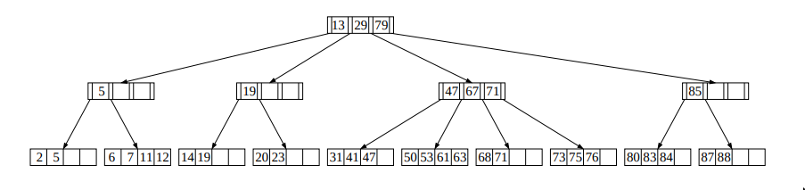
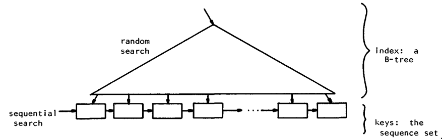

<br/><br/>
<br/><br/>
<br/><br/>
<br/><br/>
    

<div style="text-align: center;">
    <h1>Balanced B+ Trees</h1>
	<h3>Algorithms and Data Structures Report</h3>
    <h5>Degree in Bioinformatics, UPF</h5>
    <br/><br/>
    <br/><br/>
	<br/><br/>
	<br/><br/>
    <br/><br/>
    <br/><br/>
    <br/><br/>
	<p>March 2022</p>
	<p>Dante Aviñó - 106390</p>
</div>


<div style="page-break-after: always; break-after: page;"></div>

<h2> Contents </h2>

- #### [1. Introduction: Overview](#Introduction)

- #### [2. B+ Tree](#B+Tree)

  - ##### [2.1. Properties](#B+Properties)
  - ##### [2.2. Structure](#B+Structure)
  - ##### [2.3. Operations](#B+Operations)

- #### [3. Applications of the B+ Tree](#B+Uses)

  - 

- #### [4. Conclusion: Thoughts](#Conclusion)

- #### [5. References: Sources of Information](#References)

<div style="page-break-after: always; break-after: page;"></div>

<div id='Introduction'/>
<h3>1. Introduction </h3>
The goal of this report is to study and learn from authoritative sources topics related to the Algorithms and Data Structures course.

In order to understand what B+ Trees are we first need to talk about some of the history related to this data structure. Why it is created? What problem solves? What was before?

So it's first necessary a bit about to talk about Binary search trees (BST), B-trees and the differences


Explain why B-trees are used when the search structure is on disk

The difference is that in B+-trees only leaf nodes contain the actual key values. The nonleaf nodes of the B+-trees contain router values.

Routers are entities of the same type as the key values, but they are not the keys stored in the search structure. They are only used to guide the search in the tree. In classical B-trees, the key values are stored in both leaf and non-leaf nodes of the tree.


The key to performance in a DBMS is to reduce the number of disk reads, and that is accomplished by increasing the number of positive hits on the cache.

**B+ Tree vs AVL Tree**

When an index is already present in the cache, no additional disk read is necessary to find it. In a B+ tree, each index node contains many indexes whereas there are only two index entries in an AVL tree node. And just as importantly, the indexes in the B+ tree are in sequential order by the collating sequence of that key column. That is not the case in an AVL tree.

So a B+ tree may require a read of the index from disk once every ten, twenty, or even 100 records, whereas an AVL tree would need to read the disk, often more than once, for each record.

**Example**

Think of it this way… Forget about code and let's just say that you are manually thumbing through a printed product catalog, but you want to view the items in alphabetical order by name. You have a choice of using either of two index schemes:

1. A B+ tree type index where each index page contains about 100 entries to lookup. You could put a bookmark on that page (cache it) so that it would be easy to return to when you want to lookup the next entry.
2. An AVL tree index where each page has only two index entries and those are not even sequential, so you have to follow one of those to another index page that has two entries, selecting one and following it to another index page, and so forth, possibly looking up dozens of pages, until you find the leaf (destination) node. For the next lookup you have to start over from the beginning.

If you only wanted to lookup one entry, then either approach would work. But if you are scanning through those entries in order by key, the first approach could be magnitudes faster.


B-trees:

B-trees have become, de facto, a standard for file organization. File indexes of users, dedicated database systems, and general-purpose access methods have all been proposed and nnplemented using B-trees


Lectures:

Search and insertion complexities in BSTs are linear in the height of the tree. 

- Degenerate cases of low branching factor lead to slow searches, 
- it would be best to keep some balance: 
- AVL trees are binary trees that keep a height balance: the height of siblings never differs by more than one. 
- This suffices to guarantee logarithmic time search. 
- B+ trees are multiway trees (that is, many subtrees per root, very appropriate for disk-based memory) that keep a strict height balance: all leaves at the same depth. 

How do they work? 

- AVL trees keep a height balance by means of rotations. 
- B-trees and B+ trees instead keep balance by allowing a varying number of data items in each node. 
- The most elementary case of B-trees is 2-3-trees; 
- general B-trees are not common, but a little variant, B+ trees, is heavily used by many DBMS’s for index creation. 

<div style="page-break-after: always; break-after: page;"></div>

<br/><br/>
<br/><br/>


<div id='B-Tree'/>
<h3>2. B-tree data structure</h3>

<div id='Overview'/>
<h4>2.1. Overview</h4>

B-tree  structures were first defined in a paper titled 'ORGANIZATION AND MAINTENANCE OF LARGE  ORDERED INDICES' by R. Bayer and E. McCreight published in Mathematical and Information Sciences Report No. 20,  July 1970

They were intended to solve the problem of organizing and maintaining an index structure for dynamic randomly accessed file system, given the following constraint: the index structure was much larger than the capacity of the working memory, and therefore the bulk of the index was kept in a sequential access device, index entries were retrieved in chunks of data called pages from the slow sequential/pseudo-random devices. B-Trees  allowed to efficiently gather, insert and delete data, with a logarithmic execution time.

B-trees have become the de facto standard for file index organization. Moreover, indexes for users, dedicated database systems, and general-purpose access methods have all been proposed and implemented using B-trees

There are, of course, many competitive schemes for organizing an index, e.g., hash-coding. However, for a large class of applications B-Tree offers significant advantages over others:

- Storage is committed as the file grows and released as it shrinks, and there is no performance degradation as storage fills up. 
- It preserves the natural order of the keys and allows processing based on that order like, find predecessors and  successors; search the file sequentially to answer queries;  skip, delete, retrieve a number of records starting from a  glven key.  
- It provides a very efficient sequential processing of the index by presorting the transactions based on their keys.


Binary tree is the special type of general tree. **Unlike B-tree, in a binary tree a node can have at most two nodes**.


Binary Search Trees:

Search trees are data structures that support many dynamic-set operations, including SEARCH, MINIMUM, MAXIMUM, PREDECESSOR, SUCCESSOR, INSERT, and DELETE. Thus, a search tree can be used both as a dictionary and as a priority queue.

<div id='B+Tree'/>
<h3>3. B+ tree</h3>



In a B+-tree, all keys reside in the leaves. 

The upper levels, which are organized as a B-tree, consist only of an index, a roadmap to enable rapid location of the index and key parts. 

The following shows the logical separation of the index and key parts. 



Naturally, index nodes and leaf nodes may have different formats or even different sizes. In particular, leaf nodes are usually linked together left-to-right, as shown. The linked list of leaves is referred to as the sequence set. Sequence set links allow easy sequential processing.
To fully appreciate a B+-tree, one must understand the implications of having an independent index and sequence set. Consider for a moment the find operation. 

Searching proceeds from the root of a B+ tree through the index to a leaf. Since all keys reside in the leaves, it does not matter what values are encountered as the search progresses as long as the path leads to the correct leaf.

During deletion in a B+-tree, the ability to leave non-key values in the index part as separators simplifies  processing. The key to be deleted must always reside in a leaf so its removal is simple. As long as the leaf
remains at least half full, the index need not be changed, even if a copy of the key had been propagated up into it. Figure 14 shows how the copy of a deleted key can still direct searches to the correct leaf. Of course, if an underflow condition arises, the redistribution or concatenation procedures may require adjusting values in the index as well as in the leaves. Insertion and find operations in a B÷-tree are processed almost identically to insertion and find operations in a B-tree. When a leaf splits in two, instead of promoting the middle key, the algorithm promotes a copy of the key, retaining the actual key in the right leaf. Find operations differ from those in a B-tree in that searching does not stop if a key in the index equals the query value. Instead, the nearest right pointer is followed, and the search proceeds all the way to a leaf. We have seen that B-trees, which support low-cost find, insert, and delete operations, may require logdn accesses to secondary storage to process a next operation. The B÷-tree implementation retains the ogarithmic cost properties for operations by key, but gains the advantage of requiring at most 1 access to satisfy a next operation. Moreover, during the sequential processing of a file, no node will be accessed more than once, so space for only 1 node need be available in main memory. Thus, B+ trees are well suited to applications which entail both random and sequential processing

<div id='B+Structure'/>
<h4>3.1. Structure</h4>

A B+ tree T consists of nodes. One of the nodes is a special node T.root. 

If a node x is a non-leaf node, it has the following fields: 

- x.n the number of router values currently stored in node x 

- The router values stored in node x in increasing order 

  x.router1 < x.router2 < ... < x.routerx.n 

- x.leaf , a boolean field whose value is FALSE meaning that x is a non-leaf node •

- x.n+1 pointers x.c1, x.c2, x.c3,...,x.cx.n+1 to the children of x. 

If the node x is a leaf node, it has the following fields 

- x.n number of key values currently stored in x. 1 

- The key values stored in node x in increasing order 

  x.key1 < x.key2 < ... < x.keyx.n 
  
- x.leaf , a boolean field whose value is TRUE meaning that x is a leaf node. 

If we consider a non-leaf node x and pointers in it x.c1, x.c2, x.c3,...,x.cx.n+1 
the following condition is true: 
k1 ≤ x.router1 < k2 ≤ x.router2 < k3 ... < kx.n ≤ x.routerx.n < kx.n+1

where ki is any key or router value in the subtree pointed by the pointer x.ci. 

An example of the non-leaf node containing 5 router values:

<br/><br/>

<div id='B+Properties'/>
<h4>3.2. B+ Properties </h4>

The B+ tree has to satisfy the following balance conditions: 

• Every path from the root node to a leaf node has an equal length, i.e. every leaf node has the same depth which is the height of the tree. 

• Every node of the B+-tree except the root node is at least half-filled. The latter condition can be formulated more exactly: denote by s(x) the number of children of node x if x is a non-leaf node and the number of keys stored in x if x is a leaf node. Let t ≥ 2 be a fixed integer constant. For each node x of the B+-tree, the following is true: 

​	• 1 ≤ s(x) ≤ 2t, if x is the only node in the tree. 

​	• 2 ≤ s(x) ≤ 2t, if x is the root node and the tree contains also other nodes in addition to the root node. 

​	• t ≤ s(x) ≤ 2t, otherwise. 

Because the B+-tree satisfies the given balance conditions, we can prove that the hight h of the B+ tree 

<p style="text-align: center;">h ≤ logt n</p>

where n is the number of the keys stored in the tree.

<br/><br/>

<div id='B+Operations'/>
<h4>3.3. B+ Operations</h4>

<h5>Searching</h5>

```c++
BTreeSearch(T,k)
x = T.root
while not x.leaf
	i = 1
	while i ≤ x.n and k > x.routeri
		i = i+1
	x = x.ci
	DiskRead(x)
i = 1
while i ≤ x.n and k > x.keyi
	i = i+1
if i ≤ x.n and k = x.keyi
	return ( x, i )
else return NIL
```
<u>**Time Complexity**</u>

<h4>Insertion</h4>

<h4>Deletion</h4>

<div style="page-break-after: always; break-after: page;"></div>

<div id='B+Uses'/>
<<<<<<< HEAD
<h3>3. Applications of the B+ Tree</h4>
Nowadays B+ trees are one of the most popular data structures used for applications such as databases, file systems, and web caches. This is because they have the ability to store large amounts of data in a relatively small space.
=======
<h3>4. Uses of the B+ Tree</h4>
B+ trees are one of the most popular data structures for databases today. They are used to store and retrieve large amounts of data very quickly.
>>>>>>> ab62cc1d563fb8768f0c6617692e5e156a3898b6


<div style="page-break-after: always; break-after: page;"></div>

<div style="page-break-after: always; break-after: page;"></div>

<div id='Conclusion'/>
<h3>5. Conclusion: Thoughts</h4>
In a nutshell, in this report has been very interesting to perform, see and explore. 


Whether you’re interested in how exactly people get rich by mining bitcoin to do so yourself or you’re
simply curious to know about database security structure and how exactly you are identified on your accounts, the answer to that is to understand the various concepts that hashing revolves around.
Finding out these things and seeing how hashing and them are tied together was interesting and dynamic to explore and learn about, as many of these are things we observe and interact with every other day and we never really stop to give them any thought. By doing so, we learnt some more about this very special data structure and in turn about the world we live in, and that which surrounds us.

<div style="page-break-after: always; break-after: page;"></div>

<div id='References'/>
<h3>6. References: Sources of Information</h4>


**Introduction to algorithms; [Thomas H. Cormen](https://edutechlearners.com/download/Introduction_to_algorithms-3rd%20Edition.pdf), 3rd Edition (2009)**

**Organization and maintenance of large ordered indices; [R. Bayer, E. McCreight](https://infolab.usc.edu/csci585/Spring2010/den_ar/indexing.pdf), July 1970**

**The Ubiquitous B-Tree; [Comer, Douglas](http://carlosproal.com/ir/papers/p121-comer.pdf), June 1979**

**Comparison of Advance Tree Data Structures; [P. Parth, D. Garg](https://arxiv.org/pdf/1209.6495.pdf), March 2012**

**A Novel Space Based Hosting Approach for Ultra Low Latency Web Services; [Dala, Debabrata](https://www.techrxiv.org/ndownloader/files/33448376/1), January 2022**

**2-3 and B-Trees; [Shankha, Amartya](https://ocw.mit.edu/courses/electrical-engineering-and-computer-science/6-046j-design-and-analysis-of-algorithms-spring-2015/recitation-videos/recitation-2-b-trees), March 2016**

